# ⚡ MESHCORE NAVIGATOR

> **The modern desktop station, interactive RF mesh map, and multi-hop packet tracer for MeshCore & Heltec V3 LoRa radios.**  
> **Created by Nicky Proniewicz - M7NCY**

[](LICENSE)
[](https://www.python.org/)
[]()
[](https://buymeacoffee.com/soulwaystudios)

---

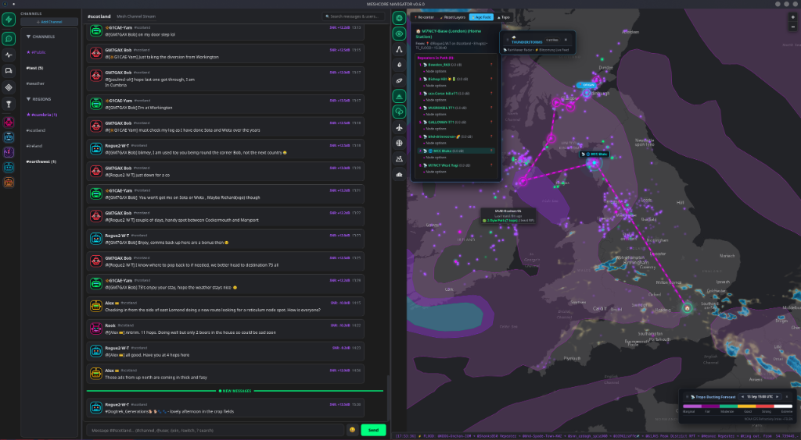

---

> ### ⚠️ Early Development Notice
> **MESHCORE NAVIGATOR is very early in development. This app will have bugs and problems.**  
> This app is developed with AI assistance by a professional working designer.  
> 
> If you like what you see so far, and want to help the development of this app, how about **[buying me a coffee](https://buymeacoffee.com/soulwaystudios)**?  
> Feel free to give feedback and report any issues or suggestions on the [GitHub Issues](https://github.com/SoulwayStudios/meshcore-navigator/issues) page!

---

## 📖 Table of Contents
- [✨ Key Features](#-key-features)
- [🗺️ Interactive Map & RF Tactical Overlays](#️-interactive-map--rf-tactical-overlays)
  - [Companion Orbitals & Tactical Range Rings](#-companion-orbitals--tactical-range-rings)
  - [RF Line-of-Sight (LOS) Viewshed & Fresnel Elevation Profile](#-rf-line-of-sight-los-viewshed--fresnel-elevation-profile)
  - [Live Tropospheric Ducting Forecast](#-live-tropospheric-ducting-forecast)
  - [Regional Scopes & Repeater Boundaries](#-regional-scopes--repeater-boundaries)
  - [Thunderstorm Doppler Radar & Lightning Strikes](#-thunderstorm-doppler-radar--lightning-strikes)
  - [ADS-B Aircraft Observer Radar](#-ads-b-aircraft-observer-radar)
  - [Multi-Hop RF Packet Route Tracing](#-multi-hop-rf-packet-route-tracing)
- [💬 Application Views & Hardware Management](#-application-views--hardware-management)
  - [Repeater Command Console & Live Neighbor Topology](#-repeater-command-console--live-neighbor-topology)
  - [Room Servers & Decentralized Mesh BBS](#-room-servers--decentralized-mesh-bbs)
  - [Radio Hardware Configuration & LoRa Presets](#-radio-hardware-configuration--lora-presets)
  - [Automated GitHub Release & Version Checker](#-automated-github-release--version-checker)
- [📥 Installation & Quick Start](#-installation--quick-start)
  - [Linux (One-Click Installer)](#linux-one-click-installer)
  - [Linux (Portable Tarball)](#linux-portable-tarball)
  - [Windows](#windows)
  - [Running from Source](#running-from-source)
- [📡 Radio Connection & Hardware Setup](#-radio-connection--hardware-setup)
- [🎨 Themes & UI Color Customization](#-themes--ui-color-customization)
- [🌐 Local REST API & SDR Bridge](#-local-rest-api--sdr-bridge)
- [☕ Support the Developer](#-support-the-developer)

---

## ✨ Key Features

- **🗺️ High-Performance Interactive Tactical Map**:
  - GPU-accelerated HTML5 Canvas rendering for hundreds of live nodes and real-time RF routes.
  - Multi-hop packet path tracing showing exact repeaters, intermediate hops, and signal metrics.
  - **RF Line-of-Sight (LOS) Viewshed & Terrain Elevation Profiles** with Fresnel zone clearance calculations.
  - Tactical **Companion Orbitals** showing docked field nodes around repeaters.
  - Real-time **Tropospheric Ducting Forecasts** (VHF/UHF propagation conditions) from NOAA GFS / F5LEN.
  - Live **Thunderstorm & Lightning Tracking** with RainViewer radar overlays and Blitzortung strike flashes.
  - **ADS-B Aircraft Tracking** around nodes with altitude color-coding and live flight callouts.
  - Regional frequency **Scopes & Repeater Boundary Polygons**.
- **📡 Repeater Console & Infrastructure Management**:
  - Direct authenticated command sessions (`!status`, `!path`, `!bat`, `!neighbors`, `!reboot`, `!info`).
  - Interactive **Mesh Neighbor Topology Mapping** displaying radiating RF links to all heard repeaters with per-link SNR metrics.
- **🏢 Room Servers & Mesh Bulletin Boards**:
  - First-class discovery and management of decentralized MeshCore Room Servers.
  - Dual-pane authentication console, password persistence in SQLite, quick commands (`!help`, `!read`, `!status`, `!list`), and real-time public bulletin streams.
- **💬 Modern Discord-Style Architecture**:
  - Foldable channel categories, unread message badges, favorites system (`★`), and direct messaging.
  - **Power Composer**: Instant `#channel` routing, `@contact` autocomplete ranked by recent RF activity, slash commands (`/join`, `/switch`), and full-text SQLite history search (`? query`).
- **📡 MeshCore Radio Controller**:
  - Full LoRa frequency, bandwidth, spreading factor, coding rate, and transmit power configuration.
  - One-click zero-hop and flood-routed node adverts broadcast.
  - Auto-detection of CP210x, CH340, FTDI, and native USB serial chips.

---

## 🗺️ Interactive Map & RF Tactical Overlays

### 🛰️ Companion Orbitals & Tactical Range Rings

High-zoom tactical view illustrating companion nodes and field stations docked in orbital rings around high-elevation repeaters. Node interaction cards provide one-click access to repeater controls, scope assignments, ADS-B radar tracking, and RF path profiling.

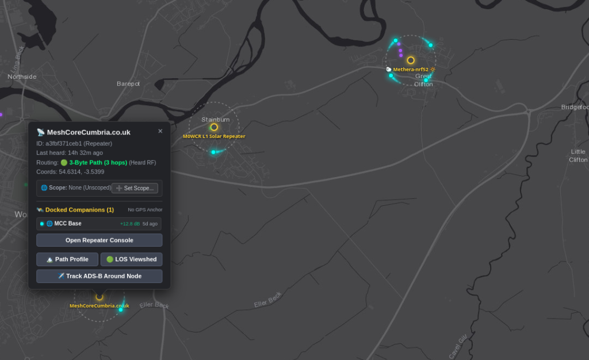

---

### ⛰️ RF Line-of-Sight (LOS) Viewshed & Fresnel Elevation Profile

Perform tactical radio propagation surveys between any two points or nodes on the map:
- **Radial LOS Viewshed**: Simulates line-of-sight RF coverage based on digital elevation terrain models with selectable antenna heights (**Ground 2m**, **Rooftop 8m**, **Mast 15m**) and configurable survey radii (up to 25 km).
- **Elevation Path Profile**: Plots the real terrain cross-section with visual Line-of-Sight ray tracing and the **1st Fresnel Zone** boundary ellipse (60% and 100% clearance thresholds).
- **Instant Feasibility Status**: Calculates exact Fresnel incursion/clearance margins in meters and reports clear optical visibility vs obstructed terrain paths.

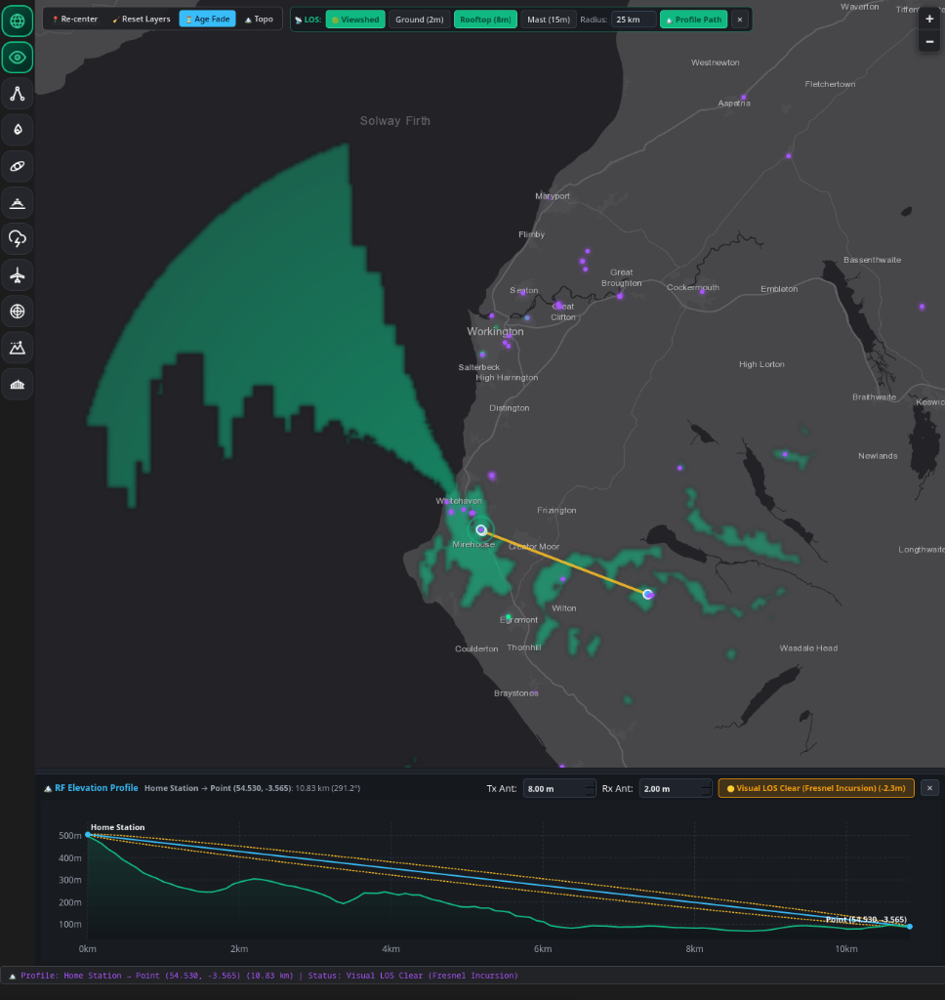

---

### 📡 Live Tropospheric Ducting Forecast

Fetches real-time NOAA GFS atmospheric refractivity index forecasts directly from F5LEN (`tropo.f5len.org`). Provides multi-tier D3 contour overlays (Marginal, Fair, Moderate, Good, Strong, Extreme) across the British Isles and Western Europe with interactive 3-hour timestep scrubbing to predict extended VHF/UHF propagation openings.

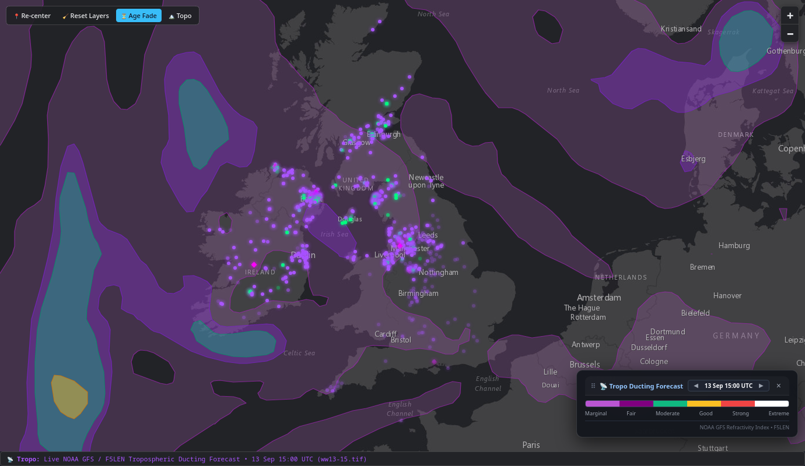

---

### 🌐 Regional Scopes & Repeater Boundaries

Visualises active regional frequency scopes and channel allocations with dynamic convex hull boundary polygons. Groups repeaters across regional backbones with dedicated neon color accents and live repeater counts. The screenshot below shows the different scopes that i have added into the system at the moment. The scopes should automatically grow and be picked up over time:

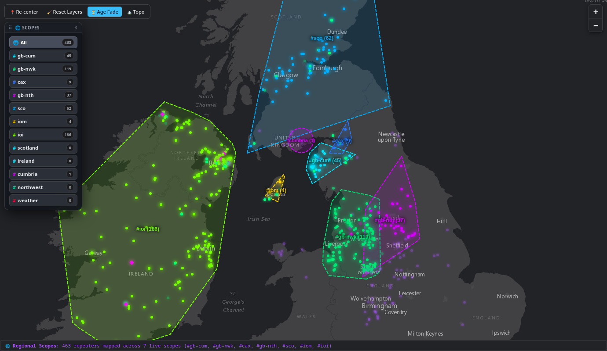

- **`#ioi` (186 repeaters)** — Island of Ireland (Lime)
- **`#gb-nwk` (119 repeaters)** — North West / Manchester / Lancashire (Emerald)
- **`#sco` (62 repeaters)** — Scotland (Blue)
- **`#gb-cum` (45 repeaters)** — Cumbria & Lake District (Cyan)
- **`#gb-nth` (37 repeaters)** — Northern England / Yorkshire (Magenta)
- **`#cax` (9 repeaters)** — Carlisle & Border (Indigo)
- **`#iom` (4 repeaters)** — Isle of Man (Amber)
All these data points are just indicative of the screenshot above and were pulled from the data.
---

### ⛈️ Thunderstorm Doppler Radar & Lightning Strikes

Streams live RainViewer Doppler precipitation radar tiles combined with real-time Blitzortung lightning strike flashes. Monitors severe storm cells and atmospheric RF noise hazards across the mesh network in real time.

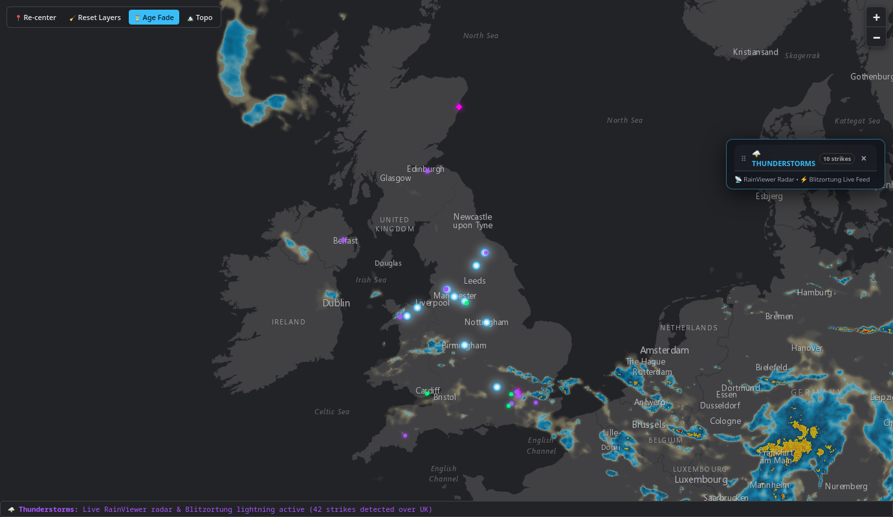

---

### ✈️ ADS-B Aircraft Observer Radar

Visualises commercial and general aviation aircraft in real time within selectable radar ranges (10 NM, 25 NM, 50 NM) around any chosen observer station. Features flight altitude color coding (Approach, Terminal, Cruising, High Altitude), headings, and flight ID callouts.

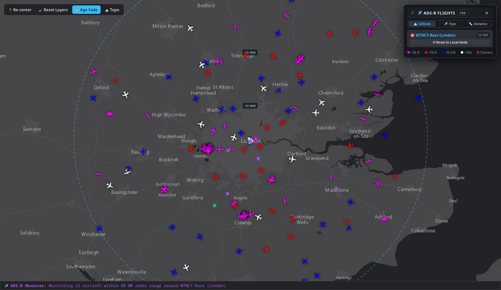

---

### ⚡ Multi-Hop RF Packet Route Tracing

Trace the exact multi-hop route taken by any heard LoRa packet from origin mobile node through intermediate mountain repeaters to the receiving base station, complete with hop SNR metrics, path geometry, and animated pulse indicators.

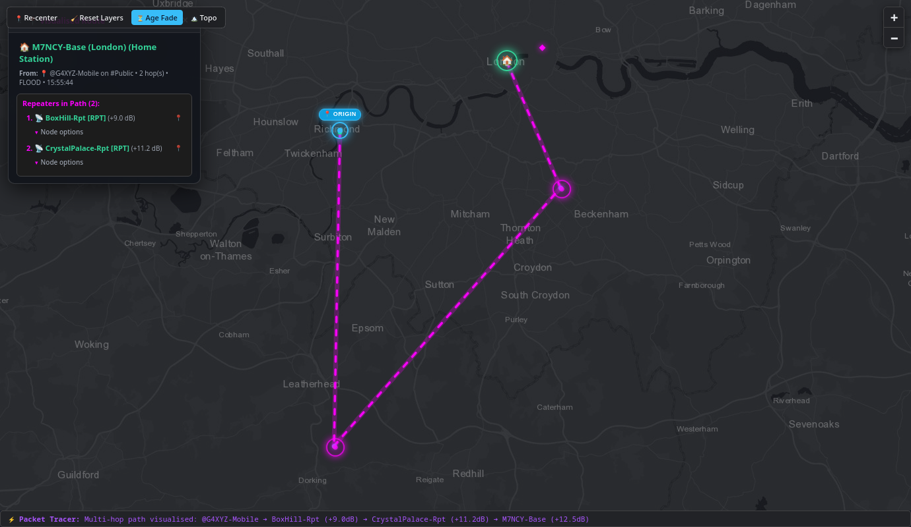

---

## 💬 Application Views & Hardware Management

### 📡 Repeater Command Console & Live Neighbor Topology

Dedicated infrastructure view for managing remote repeaters:
- **Authentication**: Direct login password management with secure persistence.
- **Interactive Neighbor Mapping**: One-click **"View Neighbors on Map"** draws RF propagation links to all heard repeater nodes with live SNR badges, range rings, and GPS coordinates.
- **Quick Commands**: Trigger `!status`, `!path`, `!bat`, `!neighbors`, `!info`, or `!reboot` commands with a single click.

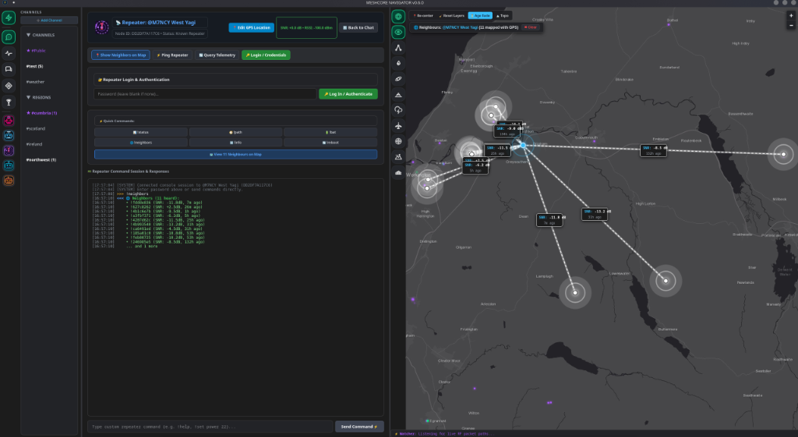

---

### 🏢 Room Servers & Decentralized Mesh BBS

Connect to decentralized Room Servers to read and publish bulletins across the mesh. Features real-time bulletin stream parsing, password management, and direct operator messaging.

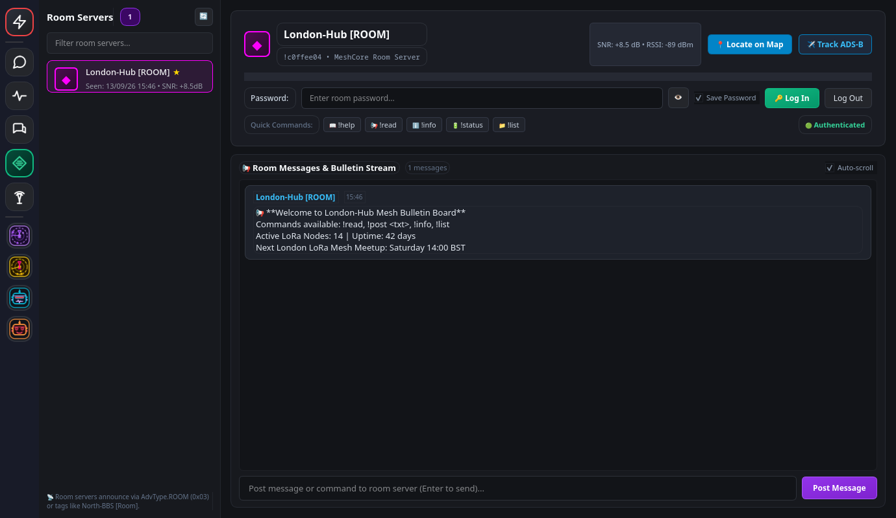

---

### ⚙️ Radio Hardware Configuration & LoRa Presets

Configure LoRa frequency parameters, regional channel plans (`UK Narrow 869.618 MHz`, `EU868`, `US915`), spreading factors, bandwidth, and transmit power with one-click radio programming over USB serial.

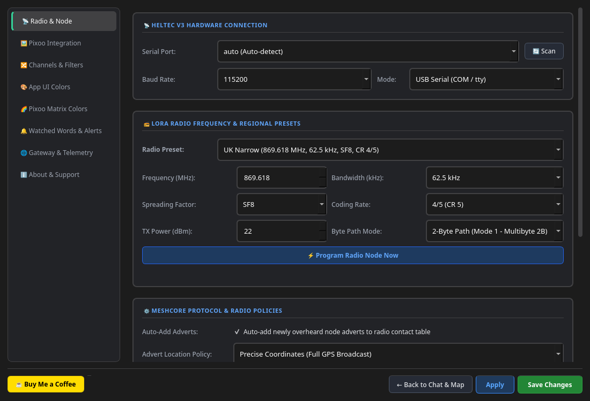

---

### 🚀 Automated GitHub Release & Version Checker

Integrated startup splash screen that automatically checks the official GitHub repository releases, displays your active version, and alerts you if an update is available with direct release links.

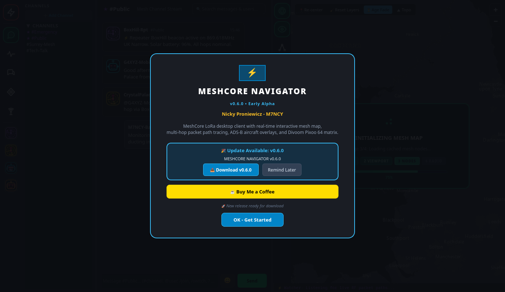

---

## 📥 Installation & Quick Start

### Linux (One-Click Installer)

Clone the repository and run the automated installer:
```bash
git clone https://github.com/SoulwayStudios/meshcore-navigator.git
cd meshcore-navigator
chmod +x install.sh
./install.sh
```
`install.sh` configures a Python virtual environment, installs the vendored libraries and dependencies, and creates a desktop menu shortcut with high-resolution app icon. You can then launch **MESHCORE NAVIGATOR** directly from your application launcher or by typing `meshcore-navigator`.

> [!TIP]
> **Arch Linux / CachyOS Users**:
> If you are on Arch Linux or CachyOS, you can optionally install system Qt6 and imaging libraries via pacman for maximum speed:
> ```bash
> sudo pacman -S python-pyqt6 python-pyqt6-webengine python-pillow python-requests python-pyserial python-qasync
> ```

### Linux (Portable Tarball)
Download `meshcore-navigator-v0.6.1-linux.tar.gz` from [GitHub Releases](https://github.com/SoulwayStudios/meshcore-navigator/releases):
```bash
tar -xzf meshcore-navigator-v0.6.1-linux.tar.gz
cd meshcore-navigator-v0.6.1-linux
./run.sh
```

### Windows
1. Download **`meshcore-navigator-windows-x64.zip`** from [Releases](https://github.com/SoulwayStudios/meshcore-navigator/releases).
2. Extract the ZIP archive anywhere on your PC.
3. Double-click **`MESHCORE-NAVIGATOR.exe`**.

### Running from Source
Ensure Python 3.10+ is installed:
```bash
python3 -m venv --system-site-packages venv
source venv/bin/activate  # On Windows: venv\Scripts\activate
pip install --upgrade pip
pip install -e ./vendor/pixoo
pip install -e ./vendor/meshcore_py
pip install -e .
python3 -m meshcore_tray.main
```
To launch in offline simulation mode without hardware:
```bash
python3 -m meshcore_tray.main --mock
```

---

## 📡 Radio Connection & Hardware Setup

1. Connect your **Heltec V3**, **T-Beam**, or compatible MeshCore node via USB.
2. Open **Settings** (click the `⚡` icon at the top of the left dock).
3. Under **Radio & Node**:
   - **Serial Port**: Leave as `auto` for automatic radio discovery, or pick your specific port (`/dev/ttyUSB*`, `/dev/ttyACM*` on Linux, `COM3` on Windows).
   - **Baud Rate**: `115200` (standard for MeshCore firmware).
   - **Connection Mode**: Choose `USB Serial (COM / tty)` or `Bluetooth Low Energy (BLE)`.
   - **LoRa Frequency & Regional Presets**: Select presets such as `UK Narrow (869.618 MHz)`, `EU868`, or `US915`.
   - Click **⚡ Program Radio Node Now** to dispatch parameters over serial to your device.

---

## 🎨 Themes & UI Color Customization

Navigate to **Settings ➔ App UI Colors**:
- Customize colors for Favorite Channels, Send Button, Channel Header, Node Markers, Visualised Packet Routes, and Phantom Nodes.
- Changes save in real-time and apply across the UI immediately.
- Use **`💾 Save Theme`**, **`⭐ Set Current Theme as Default`**, or **`↺ Reset to Default Theme`** to preserve and restore your custom look.

---

## 🌐 Local REST API & SDR Bridge

MESHCORE NAVIGATOR features an integrated HTTP JSON REST bridge listening on `http://127.0.0.1:18680`:
- `GET /api/v1/status`: Radio status, current node alias, and statistics.
- `GET /api/v1/messages?channel=public`: Retrieve channel messages.
- `POST /api/v1/messages`: Dispatch messages programmatically from external scripts, RTL-SDR bridges, or APRS gateways.

---

## 📄 License

MESHCORE NAVIGATOR is free and open-source software licensed under the **[GNU General Public License v3.0 (GPL-3.0-or-later)](LICENSE)**.

---

## ☕ Support the Developer

MESHCORE NAVIGATOR is developed and maintained as an open-source amateur radio tool by **Nicky Proniewicz (M7NCY)**.

If you find this application helpful for your MeshCore station and repeater network, consider supporting development:

[](https://buymeacoffee.com/soulwaystudios)

---

**73 de M7NCY**
